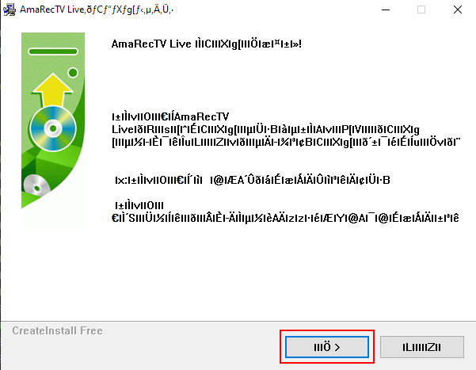

# AmaRec 64 Batch Installer

*This is for getting AmarecTV working with OBS x64 (supports versions newer than x32 support)*

Inspired/helped by https://www.speedrun.com/forums/speedrunning/3jj07 and https://iotku.pw/gvusb2-guide/ but automates the process for getting the x64 working.

By SmolAlli

(Ignore steps 1 and 2 if you have AmaRec 3.10 installed already)

1. Download and extract AmaRec 3.10 from http://www.amarectv.com/download/amarectv310.zip and move the extracted folder to wherever you want the files to be.
2. Install AmaRec Live using live_setup3000.exe (within the amarec 3.10 folder)

-   Note: If not using the Japanese local, the installer will not have any proper text on it. Just continue to click the button shown below to install it.

3. Download http://www.amarectv.com/download/live411beta.zip and extract it.
4. Move the amarec64install.bat file and live411beta folder into the AmaRec live folder.

-   Note: Please make sure that in the live411beta folder doesn't have any folders in it. It should have several files in it.

5. Run the amarec64install.bat file

-   Note: the bat file edits/overrides several files and will delete the live411beta folder once done. I'm not sure if configurations will be kept afterwards.

To do this manually instead of using the bat, follow the guide at https://www.speedrun.com/forums/speedrunning/3jj07. The bat file essentially just automates the process.
